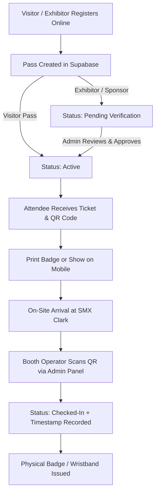

# OPFBEX 2026 Ticketing System — Feature Roadmap & Architecture Guide

This document outlines the operational workflows, technical architecture, and implementation tasks for the OPFBEX 2026 Ticketing & On-Site Event Management System.

---

## 📋 Table of Contents
1. [Core Operational Lifecycle](#1-core-operational-lifecycle)
2. [Feature Specifications & Architecture](#2-feature-specifications--architecture)
   - [F1: Same-Day Visitor Registration](#f1-same-day-visitor-registration)
   - [F2: Print Pass & PDF Badge Export](#f2-print-pass--pdf-badge-export)
   - [F3: Admin Panel & On-Site Booth Operations](#f3-admin-panel--on-site-booth-operations)
   - [F4: Camera-Based QR Code Scanner & Check-in](#f4-camera-based-qr-code-scanner--check-in)
   - [F5: PayMongo Payment Gateway Integration](#f5-paymongo-payment-gateway-integration)
   - [F6: Landing Page Video Showcase](#f6-landing-page-video-showcase)
   - [F7: Shuttle Bus Information & Booking Flow](#f7-shuttle-bus-information--booking-flow)
3. [Database Schema Enhancements (Supabase)](#3-database-schema-enhancements-supabase)
4. [Implementation Phases & Priority Matrix](#4-implementation-phases--priority-matrix)

---

## 1. Core Operational Lifecycle



---

## 2. Feature Specifications & Architecture

### F1: Same-Day Visitor Registration
* **Objective:** Determine and configure cutoff policies for same-day walk-ins.
* **Logic:**
  * **Visitor Passes:** Keep open throughout the entire expo duration (September 19–20, 2026, 6:00 PM PHT) so walk-in attendees can scan an entrance banner QR and register on their phones.
  * **Exhibitor / Sponsor Passes:** Cut off on September 12, 2026 (7 days before event) for booth preparation.
* **Files to touch:** `lib/form-constants.ts`, `app/register/[passType]/page.tsx`.

---

### F2: Print Pass & PDF Badge Export
* **Objective:** Enable attendees to print a clean, wallet-sized or lanyard-sized event badge from `/passes`.
* **Technical Approach:**
  * Implement `@media print` styling in a dedicated `PassPrintView.tsx` component or route (`/passes/[id]/print`).
  * Include: Attendee Name, Company (if applicable), Pass Type Badge, Dates, Venue, and High-Resolution QR Code.
  * Hide navigation headers, footers, and modal backdrops during printing.

---

### F3: Admin Panel & On-Site Booth Operations
* **Objective:** A secure portal for event organizers and booth operators to manage attendees.
* **Route:** `/admin` (Protected by middleware checking `profiles.role === 'admin'`).
* **Key Features:**
  * **Real-Time Stats:** Total registered, check-in count, breakdown by pass type.
  * **Pass Directory:** Searchable table (filter by status: `active`, `pending_verification`, `checked_in`, `cancelled`).
  * **Commercial Approval:** One-click button to approve Exhibitor/Sponsor passes (`pending_verification` → `active`).
  * **Operator Access:** Admins can grant `admin` role to on-site booth staff.

---

### F4: Camera-Based QR Code Scanner & Check-in
* **Objective:** Scan attendee QR codes directly from a phone or tablet browser at the entrance.
* **Technical Approach:**
  * Integrate `@zxing/library` or `html5-qrcode` in a client component (`components/admin/QRScanner.tsx`).
  * **Flow:**
    1. Operator opens `/admin/scan` on their device.
    2. Camera scans attendee ticket code (e.g. `OPFBEX-2026-VIS-4821`).
    3. App calls Supabase mutation:
       * Verifies pass validity.
       * If already checked in: Displays yellow warning with check-in timestamp.
       * If valid: Updates `status = 'checked_in'` with `checked_in_at = now()`.
       * Shows green success audio/visual feedback.

---

### F5: PayMongo Payment Gateway Integration
* **Objective:** Collect payments for paid ticket tiers (Day Pass ₱250, Weekend Pass ₱400, VIP Foodie ₱900) at `/tickets`.
* **Technical Approach:**
  * **Payment Methods:** GCash, Maya, GrabPay, Credit/Debit Card.
  * **Integration Flow:**
    1. User selects ticket tier & quantity at `/tickets`.
    2. App calls server action/route `app/api/checkout/route.ts` to create a PayMongo Checkout Session.
    3. User completes payment on PayMongo.
    4. Webhook handler `app/api/webhooks/paymongo/route.ts` receives `checkout_session.payment.paid` event.
    5. Webhook creates paid pass records in the `passes` table and triggers email confirmation.

---

### F6: Landing Page Video Showcase
* **Objective:** Build excitement by showcasing highlight footage from OPFBEX Year 1.
* **Component:** `components/home/VideoShowcase.tsx` on `app/page.tsx`.
* **Features:**
  * High-resolution video thumbnail with brutalist border styling (`border-marigold`).
  * Play button overlay that triggers a responsive modal video player (YouTube/Vimeo embed or hosted MP4).

---

### F7: Shuttle Bus Information & Booking Flow
* **Objective:** Provide attendees with clear transit schedules and pickup routes to SMX Clark.
* **Features:**
  * **Route Schedule:** Key pickup hubs (Dau Bus Terminal, Clark International Airport, SM City Clark, Angeles City).
  * **Timetable & Map:** Interactive route timeline.
  * **Booking CTA:** External link or integrated form to reserve shuttle slots.

---

## 3. Database Schema Enhancements (Supabase)

To support QR check-ins, payment logs, and admin access, here is the upcoming SQL extension:

```sql
-- 1. Extend Pass Status Check to include 'checked_in'
ALTER TABLE public.passes 
  DROP CONSTRAINT IF EXISTS passes_status_check;

ALTER TABLE public.passes 
  ADD CONSTRAINT passes_status_check 
  CHECK (status IN ('active', 'cancelled', 'pending_verification', 'checked_in'));

-- 2. Add check-in tracking columns
ALTER TABLE public.passes 
  ADD COLUMN IF NOT EXISTS checked_in_at TIMESTAMPTZ,
  ADD COLUMN IF NOT EXISTS checked_in_by UUID REFERENCES public.profiles(id),
  ADD COLUMN IF NOT EXISTS payment_id TEXT,
  ADD COLUMN IF NOT EXISTS amount_paid NUMERIC DEFAULT 0;

-- 3. Admin RLS Policy for Passes (Admins can view and update all passes)
CREATE POLICY "Admins can manage all passes"
  ON public.passes FOR ALL
  USING (
    EXISTS (
      SELECT 1 FROM public.profiles
      WHERE profiles.id = auth.uid() AND profiles.role = 'admin'
    )
  );
```

---

## 4. Implementation Phases & Priority Matrix

| Phase | Feature | Complexity | Dependencies |
| :--- | :--- | :--- | :--- |
| **Phase 1 (Immediate)** | **Print Pass & QR Code Generation** | Medium | `qrcode.react`, CSS Print Styles |
| **Phase 1 (Immediate)** | **Same-Day Registration Policy** | Low | Form cutoff date adjustments |
| **Phase 2 (Operations)**| **Admin Panel & Operator RBAC** | Medium | Supabase RLS, Admin layout |
| **Phase 2 (Operations)**| **QR Scanner & On-Site Check-in** | Medium | `html5-qrcode`, Admin APIs |
| **Phase 3 (E-Commerce)**| **PayMongo Payment Integration** | High | PayMongo Secret Keys, Webhooks |
| **Phase 4 (Marketing)** | **Landing Video & Shuttle Section**| Low | Video assets, transit schedule |