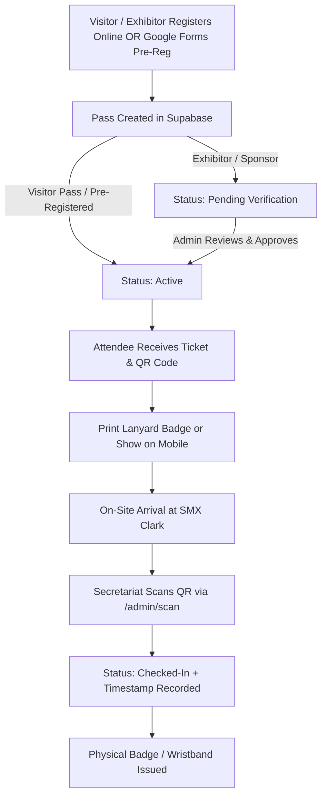

# OPFBEX 2026 Ticketing System — Feature Roadmap & Architecture Guide

This document outlines the operational workflows, technical architecture, and implementation tasks for the OPFBEX 2026 Ticketing & On-Site Event Management System.

---

## 📋 Table of Contents
1. [Current Milestone Status](#1-current-milestone-status)
2. [Core Operational Lifecycle](#2-core-operational-lifecycle)
3. [Feature Specifications & Architecture](#3-feature-specifications--architecture)
   - [Completed Features](#completed-features)
     - [F1: Same-Day Visitor Registration](#f1-same-day-visitor-registration)
     - [F2: Print Pass & PDF Badge Export](#f2-print-pass--pdf-badge-export)
     - [F3: Admin Panel & On-Site Booth Operations](#f3-admin-panel--on-site-booth-operations)
     - [F4: Camera-Based QR Code Scanner & Check-in](#f4-camera-based-qr-code-scanner--check-in)
     - [F5: Google Forms Ingestion & Dual-Persona Claiming](#f5-google-forms-ingestion--dual-persona-claiming)
     - [F6: Public Authentication & Route Refactor](#f6-public-authentication--route-refactor)
   - [In-Progress & Upcoming Features (`feature/ui-enhancements`)](#in-progress--upcoming-features-featureui-enhancements)
     - [F7: Landing Page Video Showcase (Past Event Footage)](#f7-landing-page-video-showcase-past-event-footage)
     - [F8: Sponsor & Partner Infinite Logo Belt](#f8-sponsor--partner-infinite-logo-belt)
     - [F9: Shuttle Bus Transit Schedule & Route Maps](#f9-shuttle-bus-transit-schedule--route-maps)
   - [Phase 3 (E-Commerce)](#phase-3-e-commerce)
     - [F10: PayMongo Payment Gateway Integration](#f10-paymongo-payment-gateway-integration)
4. [Database Schema Enhancements (Supabase)](#4-database-schema-enhancements-supabase)
5. [Implementation Phases & Priority Matrix](#5-implementation-phases--priority-matrix)

---

## 1. Current Milestone Status

| Feature / Phase | Status | Summary |
| :--- | :--- | :--- |
| **F1: Same-Day Registration** | ✅ **Completed** | Dynamic cutoffs configured in `lib/form-constants.ts`; visitor registrations open through event close. |
| **F2: Print Pass & PDF Export** | ✅ **Completed** | Lanyard-sized badge generator with `@media print` styling, crisp QR code, and dark purple theme preservation. |
| **F3: Admin Directory & Ops** | ✅ **Completed** | Real-time pass search, status filtering, attendee stats, and commercial pass approvals in `/admin`. |
| **F4: QR Scanner & Check-in** | ✅ **Completed** | Camera scanning with `@zxing`/`html5-qrcode`, audio chime, and duplicate scan alerts in `/admin/scan`. |
| **F5: Google Forms Migration** | ✅ **Completed** | 394 registrants ingested; zero-login email lookup & atomic claim stored procedure in Postgres. |
| **F6: Dedicated Auth & Routes** | ✅ **Completed** | Clean separation of `/register-visitor`, `/register-exhibitor`, `/register-sponsor`, `/signin`, and `/signup`. |
| **F7: Ambient Video Showcase** | ✅ **Completed** | Cinematic ambient video background in Hero (`HeroVideoBackground.tsx`) with understated modal recap trigger (`WatchReelButton.tsx`). |
| **F8: Sponsor Logo Belt** | ✅ **Completed** | 3-tier responsive marquee (`SponsorMarquee.tsx`) featuring 128 brands on brand marigold with borderless floating logos. |
| **F9: Shuttle Bus Transit** | ⏳ **Upcoming** | Key pickup hubs (Dau, Clark Airport, SM Clark) with timetable schedule on homepage. |
| **F10: PayMongo E-Commerce** | ⏳ **Upcoming** | Paid ticket checkout session API & webhook verification at `/tickets`. |

---

## 2. Core Operational Lifecycle

---

## 3. Feature Specifications & Architecture

### Completed Features

#### F1: Same-Day Visitor Registration
* Dynamic registration cutoff timestamps in `lib/form-constants.ts`.
* Visitor passes remain available throughout the expo (Sept 19–20, 2026), while exhibitor/sponsor registrations close 7 days prior.

#### F2: Print Pass & PDF Badge Export
* Dedicated print view at `/passes/[id]/print` with lanyard badge styling and `print-color-adjust: exact`.

#### F3: Admin Panel & On-Site Booth Operations
* Full attendee directory at `/admin` with search by name/email/company, filter by status, and commercial verification tools.

#### F4: Camera-Based QR Code Scanner & Check-in
* Web scanner at `/admin/scan` with instant audio feedback and duplicate pass warnings.

#### F5: Google Forms Ingestion & Dual-Persona Claiming
* 394 Google Forms responses ingested to `public.google_forms_registrants`.
* Public claim widget (`ClaimGoogleFormsPass.tsx`) allows pre-registered attendees to claim their official ticket code and print without prior sign-in.
* Robust Postgres stored procedure `claim_google_forms_pass` cleanly parses attendee preferences (`daysAttending`, `purposes`).

#### F6: Public Authentication & Route Refactor
* Independent, SEO-optimized landing routes for `/register-visitor`, `/register-exhibitor`, `/register-sponsor`, `/signin`, and `/signup`.

#### F7: Ambient Video Showcase & Recap Reel
* **Hero Background:** `HeroVideoBackground.tsx` provides high-definition ambient video loop (`.webm` + `.mp4`) behind the Hero section with asymmetric brand grape gradients to preserve text legibility.
* **Modal Trigger:** `WatchReelButton.tsx` provides an understated ghost link trigger opening a responsive 16:9 modal player with full audio, controls, and `ESC` dismissal.

#### F8: 3-Tier Sponsor & Partner Logo Belt
* **Brand Ingestion:** 128 participating brands (35 Partners, 13 Sponsors, 80 Exhibitors) parsed from `lib/OPFBEX2026 - Brand List.csv` into typed data structure `lib/brand-data.ts`.
* **Design & Motion:** `SponsorMarquee.tsx` renders borderless floating logos directly on the OPFBEX `marigold` surface with brutalist grape corner crosshairs, fluid responsive sizing (`sm:`, `md:`, `lg:`), and organic hierarchy conveyed through proportion, spacing, and velocity.

---

### In-Progress & Upcoming Features 

#### F9: Shuttle Bus Transit Schedule & Route Maps
* **Objective:** Provide clear transit information and pickup points to SMX Convention Center Clark.
* **Features:**
  * Key pickup points: Dau Bus Terminal, Clark International Airport (CRK), SM City Clark, Angeles City Heritage District.
  * Timetable intervals with interactive schedule tabs.

---

### Phase 3 (E-Commerce)

#### F10: PayMongo Payment Gateway Integration
* **Objective:** Collect payments for paid ticket tiers (Day Pass ₱250, Weekend Pass ₱400, VIP Foodie ₱900) at `/tickets`.
* **Payment Methods:** GCash, Maya, GrabPay, Credit/Debit Card via PayMongo Checkout Session API and Webhook listener.

---

## 4. Implementation Phases & Priority Matrix

| Phase | Feature | Complexity | Target Branch |
| :--- | :--- | :--- | :--- |
| **Phase 1 (Complete)** | **Same-Day Reg, Print Badges, Admin Directory, QR Scanner** | Medium | `main` |
| **Phase 1.5 (Complete)**| **Google Forms 394 Migration & Public Claim Flow** | High | `main` |
| **Phase 2 (Current)** | **UI Enhancements: Video Showcase & Sponsor Logo Belt** | Low-Medium | `feature/ui-enhancements` |
| **Phase 2.5 (Current)**| **Transit & Shuttle Bus Timetable Section** | Low | `feature/ui-enhancements` |
| **Phase 3 (Upcoming)** | **PayMongo Payment Integration & Webhook Sync** | High | `feature/paymongo-ecommerce` |